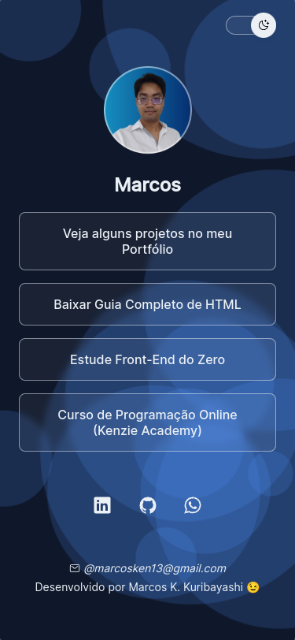
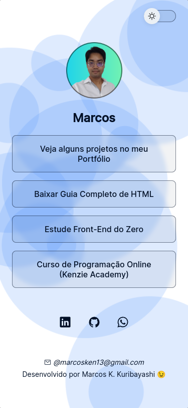
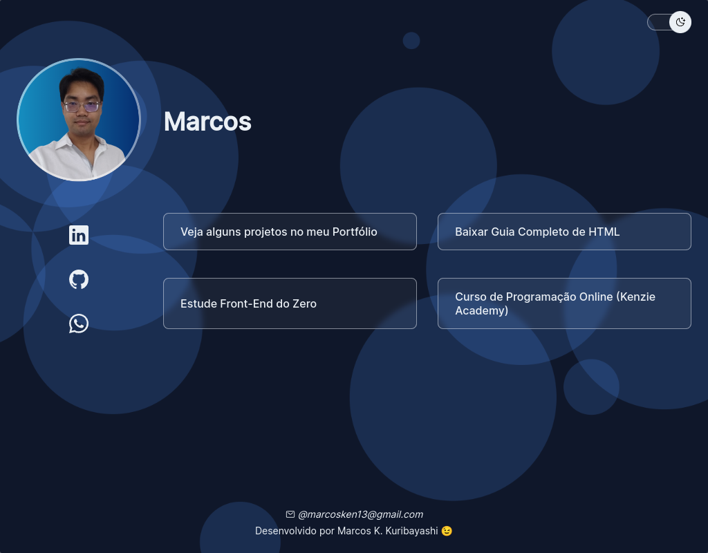

<!-- CABEÇALHO -->

    <h1 style="color: #4F91F9">
        KenLinks 🖱️
    </h1>
    

        <a href="#%EF%B8%8F-sobre-o-projeto">Sobre o Projeto</a> •
        <a href="#-funcionalidades">Funcionalidades</a> •
        <a href="#-layout">Layout</a> •
        <a href="#%EF%B8%8F-tecnologias">Tecnologias</a> •
        <a href="#-autor">Autor</a>
    

<!-- SOBRE O PROJETO -->

## 🖥️ Sobre o Projeto

    

 
Este projeto trata-se de uma página web semelhante ao [Linktree](https://linktr.ee/), onde são exibidos uma lista de links para redes sociais, sites pessoais e outros recursos online.

O objetivo desse projeto foi revisistar e treinar os conceitos básicos do desenvolvimento front-end, incluindo manipulação de DOM e JavaScript puro.

A página possui design responsivo e tema dark/light.

<!-- FUNCIONALIDADES -->

## 💡 Funcionalidades

- [x] Exibição de lista de links
- [x] Temas dark/light
- [x] Responsividade

<!-- LAYOUT -->

## 🎨 Layout

  

  

  

<!-- TECNOLOGIAS -->

## 🛠️ Tecnologias

Para o desenvolvimento desse projeto, as seguintes ferramentas foram utilizadas:

- **[HTML](https://pt-br.reactjs.org/)**
- **[CSS](https://nextjs.org/)**
- **[JavaScript](https://www.typescriptlang.org/)**

## 👨‍💻 Autor

Marcos Kenji Kuribayashi

 

---

Desenvolvido por Marcos Kenji Kuribayashi 😉
